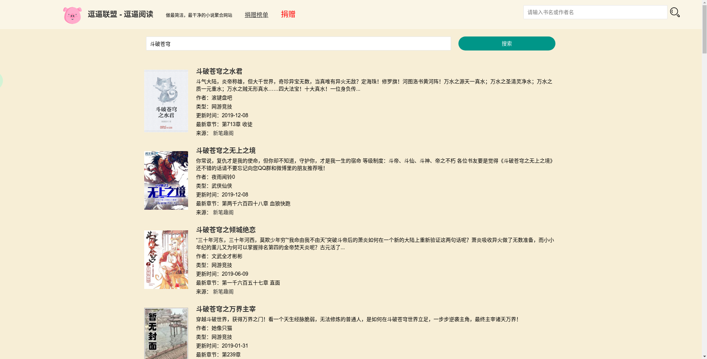
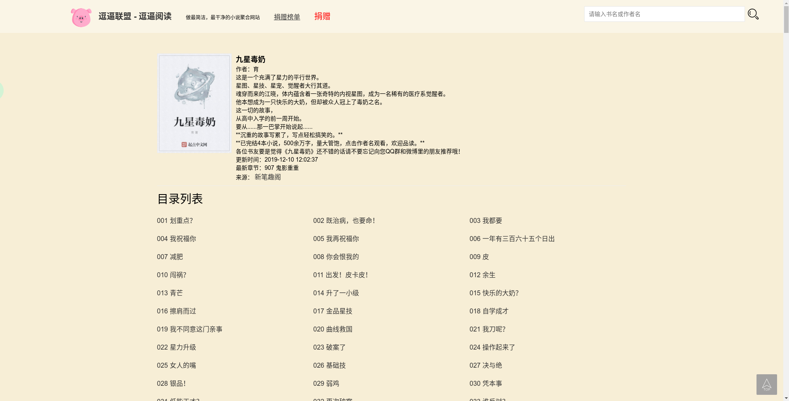
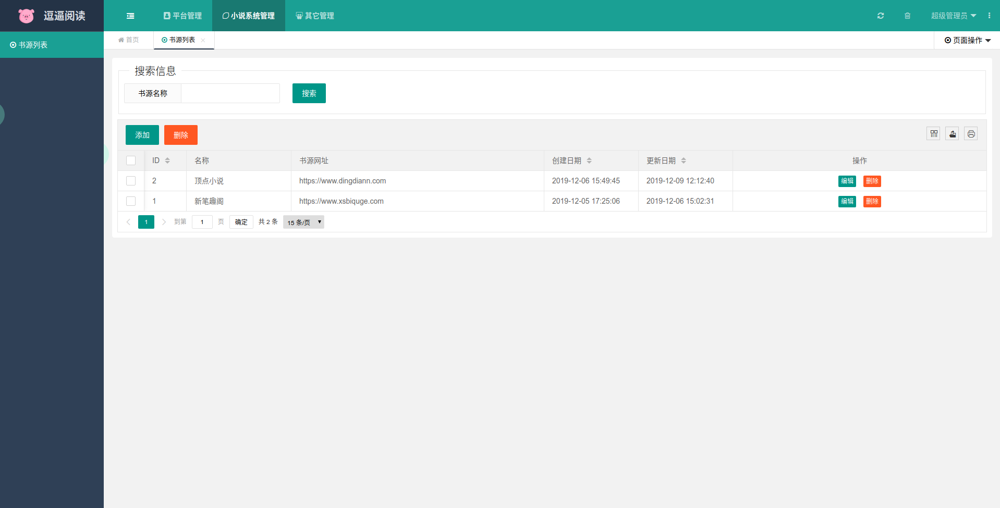

# DouBiNovel-在线网络小说阅读网站&小说搜索引擎
JDK1.8  + Spring Boot 2.x  
编译器：idea

**逗逼阅读** 是一个基于其他搜索引擎构建的小说搜索引擎，**逗逼阅读**目的是让阅读更简单、优雅，让每位读者都有舒适的阅读体验，目前支持**在线搜书、在线阅读等功能**
* 演示网站：[http://novel.luckymorning.cn](http://novel.luckymorning.cn)
* **注意：** 若将本项目部署并发行，请声明来源，本项目纯属共享学习之用，**不得用于商业！**
## 介绍
### 开发原因
1. 转眼间离开学校也要两年了，想要对自己有个阶段性的提炼吧，每天做着项目都感觉自己就是一个咸鱼；
2. 学着规范自己的代码，以及模块的提炼，降低项目模块的耦合性，以便日后的项目可以复用相关模块
3. 至于选择小说聚合网站的原因，原来一直使用的**Aiys云小说**由于各种原因关闭了，于是萌发自己做一个的念头  
###更新log
#### 2020-02-03新增功能  
* 系统公告功能
* 正式启用域名
#### 2020-01-02新增功能  
* 阅读界面异步加载目录列表
#### 2019-12-31新增功能
* 完成网络阅读记录缓存功能
#### 2019-12-26新增功能
* 增加我的书架功能
#### 2019-12-17 新增功能
####前端
* 用户通过邮件注册账号
* 用户通过账号密码登录
####后端
* 邮箱发送服务
### 目前支持功能
#### 前端
* 在线搜索
* 界面统一解析
* 在线阅读
* 捐赠列表  
* 系统公告展示
#### 后端
##### 平台管理
* 登录
* 系统设置
    * 平台参数设置（网站名称、网站域名、首页标题、META关键词、META描述、版权信息）
    * 更新日志管理（更新日志的列表以及增、删、改、查）
* 角色权限管理
    * 权限组管理（平台权限组的列表以及增、删、改、查）
    * 权限管理（平台权限的列表以及增、删、改、查）
    * 角色管理（平台用户角色的列表以及增、删、改、查）
* 用户管理（平台用户的列表以及增、删、改、查）
* 捐赠管理（平台捐赠信息的列表以及增、删、改、查）
##### 小说系统管理
* 书源管理（平台书源信息的列表以及增、删、改、查）
### 接下来计划
* 前端
    * 书签功能
    * 排行榜展示（搜索排行榜，热门排行榜）
 ### 安装部署
 #### Linux（以ubuntu为例）
 * 安装redis：sudo apt-get install redis-server  
 安装后端口默认6379，密码为空，若需加密，请参照[**redis端口及密码配置文件修改**](https://www.cnblogs.com/konglingxi/p/9452276.html)
 * 安装MySQL：[安装教程](https://blog.csdn.net/sinat_37064286/article/details/82224562)
 * 安装JDK：[安装教程](https://blog.csdn.net/qq_41892229/article/details/81773079)
 * 安装Tomcat：[安装教程](https://blog.csdn.net/weixx3/article/details/80808484)
 #### Windows
 * 安装redis：下载地址：[https://github.com/MSOpenTech/redis/releases](https://github.com/MSOpenTech/redis/releases)  
 安装后端口默认6379，密码为空，若需加密，请参照[**redis端口及密码配置文件修改**](https://www.cnblogs.com/konglingxi/p/9452276.html)
 * 安装MySQL：[安装教程](https://blog.csdn.net/bobo553443/article/details/81383194)
 * 安装JDK：[安装教程](https://jingyan.baidu.com/article/6dad5075d1dc40a123e36ea3.html)
 * 安装Tomcat：[安装教程](https://blog.csdn.net/qq_36309983/article/details/79867313)
 ####项目部署  
  * redis参数修改，路径：Model-Common/src/main/resources/redis.properties  
     默认端口：6379  
     默认密码：空
  * 数据库参数修改，路径：Model-Web/src/main/resources/application.properties  
     默认url：127.0.0.1:3306  
     默认数据库名称：novel  
     默认数据库账号：root  
     默认数据库密码：root
  * 将打包的war文件解压到tomcat运行目录中
### PS
* 系统后台管理员登录账号密码均为admin
### 截图
* 前端首页

* 前端搜索列表

* 前端章节列表

* 前端阅读界面

* 后端书源管理界面

### 项目技术
* **SpringBoot2：** WEB框架
* **Shiro：** 权限验证校验
* **DB数据存储：** MySQL
* **缓存数据存储：** Redis
* **前后端页面：** [LayUI](https://www.layui.com/)
### 第三方包
* **MyBatis：** web项目对数据库的操作
* **OKHttp3：** 用于网络请求
* **JSoup：** 用于html页面解析提取
## Donate
如果觉得**逗逼阅读**对您有帮助，那么您可以给开发者一些支持：
* **start** 或者 **follow**
* 服务器的基本开销
* 请我喝杯咖啡啦
* 为用户提供更好的阅读环境
### 感谢以下捐赠者
* 详情见[捐赠名单](http://novel.luckymorning.cn//donate/list)
### 请各位扫一扫
| 支付宝 | 微信 |
| :----: | :----: |
|  |  |

